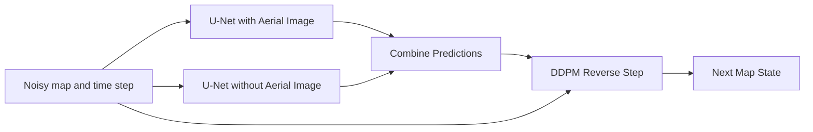

# Deep Learning Methods

## Deep Learning - Computer Vision - Conditional Diffusion Models

Generate an RGB map from an aerial image using a _Conditional Diffusion Model_.

> Notebook by:
> - Royi Avital RoyiAvital@fixelalgorithms.com

## Conditional Diffusion Model

In the _Conditional VAE_, the condition tells the decoder what to generate, while the sampled latent vector allows variation.  
A _Conditional Diffusion Model_ uses the same idea, but supplies the condition at every denoising step instead of decoding in a single pass.

In this notebook:
 - _Condition_ $\boldsymbol{x}$: The aerial image.
 - _Target_ $\boldsymbol{y}_0$: The corresponding map.
 - _Generated Sample_: A map which should match the aerial image.

An unconditional model learns to generate maps from $p \left( \boldsymbol{y}_0 \right)$.  
A conditional model learns to generate maps from $p \left( \boldsymbol{y}_0 \mid \boldsymbol{x} \right)$.

Intuitively, the condition narrows the possible outputs. It guideline the model to generate a plausible map of the place given by $\boldsymbol{x}$, not just a plausible map.

* (**#**) The condition can be a class label, text, an image, or other information available during both training and generation.
* (**#**) This is paired image translation. The target is an RGB image, not a set of segmentation labels.

### Denoising Diffusion Probabilistic Model (DDPM) Target

The forward process mixes the target map with Gaussian noise. Write the signal and noise scales as $a_t = \sqrt{\bar\alpha_t}$ and $b_t = \sqrt{1 - \bar\alpha_t}$:

$$ \boldsymbol{y}_t = a_t \boldsymbol{y}_0 + b_t \boldsymbol{\epsilon}, \qquad a_t^2 + b_t^2 = 1, \qquad \boldsymbol{\epsilon} \sim \mathcal{N} \left( \boldsymbol{0}, \boldsymbol{I} \right) $$

The denoiser always receives the noisy map, the time step, and the aerial image. What changes is the target it learns to predict. In these equations, the aerial image and the map are already normalized.

#### Three Prediction Targets

 - _Noise_: Which noise was added to the map?
 - _Clean_: What was the map before adding noise?
 - _Velocity_: Predict a time-dependent combination of the noise and the clean map:

$$ \boldsymbol{v}_t = a_t \boldsymbol{\epsilon} - b_t \boldsymbol{y}_0 $$

At low noise, $\boldsymbol{v}_t \approx \boldsymbol{\epsilon}$. At high noise, $\boldsymbol{v}_t \approx -\boldsymbol{y}_0$. It smoothly changes from a noise target to a clean-image target with a minus sign.

Why _Velocity_? Writing $a_t = \cos \phi_t$ and $b_t = \sin \phi_t$ gives $\boldsymbol{v}_t = \mathrm{d}\boldsymbol{y}_t / \mathrm{d}\phi_t$: the rate at which the noisy image changes along this path, with the clean image and noise held fixed.

Each prediction can be converted into a clean-map estimate for the same reverse update:

| Variant  | Training Target         | Clean-Map Estimate                                                        | MSE Weight $w_t$     |
| -------- | ----------------------- | ------------------------------------------------------------------------- | -------------------- |
| Noise    | $\boldsymbol{\epsilon}$ | $\left( \boldsymbol{y}_t - b_t \hat{\boldsymbol{\epsilon}} \right) / a_t$ | $\mathrm{SNR}_t$     |
| Clean    | $\boldsymbol{y}_0$      | $\hat{\boldsymbol{y}}_0$                                                  | $1$                  |
| Velocity | $\boldsymbol{v}_t$      | $a_t \boldsymbol{y}_t - b_t \hat{\boldsymbol{v}}_t$                       | $1 + \mathrm{SNR}_t$ |

Here $\mathrm{SNR}_t = a_t^2 / b_t^2$ is the signal-to-noise ratio. For $0 < \bar\alpha_t < 1$, MSE on each target equals $w_t {\left\| \hat{\boldsymbol{y}}_0 - \boldsymbol{y}_0 \right\|}_2^2$ for its corresponding clean-map estimate.

#### Why the Choice Matters

When learning the reverse process, we can choose how much the error at each noise level matters. Under MSE, different prediction targets implicitly assign different weights to clean-map error along the same diffusion path:
 - _Noise_: In terms of clean-map error, MSE puts more weight on low-noise steps. At high noise, converting the prediction back to a map divides by a small $a_t$, amplifying prediction errors.
 - _Clean_: MSE gives clean-map error equal weight across time steps. At low noise, much of the answer is visible; at high noise, the aerial condition becomes especially useful.
 - _Velocity_: Its MSE weighting behaves like noise prediction at low noise and clean prediction at high noise. Recovering the clean map avoids division by a small $a_t$.

We can also keep the target fixed and multiply its loss by a positive time-dependent weight. A larger weight gives that noise level's error more influence during backpropagation. This changes the training emphasis, not the forward noise schedule; sampling does not minimize a training loss at each step.

These are differences in parameterization and loss weighting, not guarantees that one target always produces better images.

#### Choice Used Here

Here, `predictType = 'Clean'` makes the aerial-to-map objective explicit: estimate the map even when little of it remains visible.

$$ \hat{\boldsymbol{y}}_0 = f_{\boldsymbol{w}} \left( \boldsymbol{y}_t, t, \boldsymbol{x} \right) $$

The reverse process uses that estimate to take one denoising step; generation still requires repeated steps.

* (**#**) During the forward process the aerial condition is not diffused.
* (**#**) The weight comparison above assumes MSE. The implementation uses _SmoothL1_, so the exact squared-error weighting does not apply.
* (**#**) The implementation supports noise and clean prediction. Velocity is an extension, not an available `predictType` option.
* (**?**) Why are training losses for different targets not directly comparable? What would you compare instead?
* (**@**) Implement velocity prediction and its conversion to a clean map. Compare generated maps under the same training budget and sampling settings.

### Conditional Diffusion with Classifier Free Guidance

Ordinary conditioning supplies the aerial image to the denoiser. _Classifier Free Guidance_ (CFG) adds a way to adjust the influence of that condition during generation.

#### Training with and without the Condition

During training, randomly hide the aerial image for some samples. The same network learns two tasks:
 - _With the Condition_: Recover the map using the noisy map and the aerial image.
 - _Without the Condition_: Recover the map using the noisy map alone.

The condition is dropped with probability `conditionDropProb`. The target map is unchanged. No separate model or classifier is trained.

#### Combining the Predictions

At the same noisy map and time step, evaluate the network with and without the condition:

$$ \hat{\boldsymbol{y}}_{0,\mathrm{Cond}} = f_{\boldsymbol{w}} \left( \boldsymbol{y}_t, t, \boldsymbol{x} \right), \qquad \hat{\boldsymbol{y}}_{0,\mathrm{Uncond}} = f_{\boldsymbol{w}} \left( \boldsymbol{y}_t, t, \varnothing \right) $$

Their difference represents the effect of supplying the aerial image. CFG scales that difference:

$$ \hat{\boldsymbol{y}}_{0,\mathrm{CFG}} = \hat{\boldsymbol{y}}_{0,\mathrm{Uncond}} + s \left( \hat{\boldsymbol{y}}_{0,\mathrm{Cond}} - \hat{\boldsymbol{y}}_{0,\mathrm{Uncond}} \right) $$

 - $s = 0$: Use the unconditional prediction.
 - $s = 1$: Use the conditional prediction.
 - $s > 1$: Extrapolate in the direction of the conditional prediction.

The guided estimate is used in the next reverse step. These are predictions for the same noisy input, not two finished images being blended.

* (**#**) `guidanceScale` changes sampling, not the trained weights. Stronger guidance can introduce artifacts and need not improve accuracy.
* (**?**) Why do we hide the condition during training if we want to use CFG during generation?
* (**#**) Reference: [Classifier Free Diffusion Guidance](https://arxiv.org/abs/2207.12598).

## Generate / Load Data

The data is the [SatAerialToMap dataset](https://huggingface.co/datasets/Royi/DataSets). Each image contains an aerial image on the left and its aligned map on the right.

This section:
 - Loads the paired images.
 - Creates training and validation datasets.
 - Plots the pairs and defines the transforms.
 - Builds the data loaders.

* (**!**) Go through `SatAerialMapDataset`. Identify which image supplies the condition and which image supplies the training target.
* (**#**) This notebook combines the supplied folders and creates a new random split. Nearby geographic tiles may be correlated; a geographic split is preferable when evaluating generalization to new locations.

### Plot the Data

* (**?**) Which structures must remain in the same location when translating an aerial image into a map?

### Augmentation / Transform

The images form a pair, so their spatial alignment must be preserved:
 - _Geometric Transforms_: Apply the same flip and rotation to both images.
 - _Photometric Transforms_: Change only the aerial image's appearance, leaving the target map colors unchanged.

Validation uses neither random geometric nor random photometric augmentation.

* (**?**) What would the model learn if we flipped the aerial image without flipping its target map?

### Forward and Reverse Diffusion Schedule

The schedule controls the amount of noise added to a clean map and the coefficients used in each reverse step. The condition changes the network's prediction, not the forward noising formula.

* (**#**) In code, index `0` is the first noisy state ($t = 1$). The clean map is $\boldsymbol{y}_0$.

### Data Loaders

Each batch contains aligned aerial images and maps. The training loop samples the time steps and diffusion noise.

* (**#**) The notebook uses `numWorkers = 0` so data loading stays in the main process, including on Windows.

### Target Map Statistics

Aerial images are scaled from $[0,1]$ to $[-1,1]$. Maps are centered using their training-set mean per channel and scaled by a single shared standard deviation:

$$ \boldsymbol{y}_0 = \frac{\boldsymbol{y}_{\mathrm{RGB}} - \boldsymbol{\mu}}{\sigma} $$

This gives the map values a convenient scale relative to the added noise. Using one shared scale avoids weighting RGB channel errors differently through normalization.

After generation, undo this transform to display the map in RGB.

* (**#**) Compute the statistics on the training set only. Centering and scaling are practical training choices, not a requirement for the forward process to approach Gaussian noise.

## Build the Conditional Denoiser

The model is a convolutional _U-Net_. The aerial condition is concatenated with the noisy map at the network's input.

The image input has seven channels:
 - Three channels for the noisy map.
 - Three channels for the aerial image.
 - One channel indicating whether the condition is present.

When the condition is hidden, both the aerial channels and the presence channel are zero. Otherwise, the presence channel is one. This distinguishes a missing condition from an aerial image whose normalized values happen to be zero.

The model uses:
 - _Time Embedding_: Tells each residual block the noise level.
 - _Downsampling_: Builds features at several spatial scales.
 - _Skip Connections_: Carries spatial detail to the decoder.
 - _Self Attention_: Allows distant locations to exchange information at lower resolutions.

The output has three channels: the estimated clean map for `predictType = 'Clean'`.

* (**#**) Concatenation is a simple way to supply an aligned image condition. Unlike the categorical condition in the CVAE, the aerial image already has a spatial representation.
* (**!**) Inspect the model's input construction. Verify that changing the aerial image has no effect when the condition-presence flag is zero.

## Train the Model

For each paired sample:
1. Normalize the images and sample a time step $t$.
2. Add Gaussian noise to the target map.
3. Randomly keep or hide the aerial condition.
4. Predict the clean map and compare it with the target.
5. Backpropagate and update the model.

Let $\boldsymbol{c}$ be the aerial condition or $\varnothing$ when it is hidden. The training objective is:

$$ \mathcal{L} \left( \boldsymbol{w} \right) = \mathbb{E}_{\boldsymbol{x},\boldsymbol{y}_0,t,\boldsymbol{\epsilon},\boldsymbol{c}} \left[ \ell \left( f_{\boldsymbol{w}} \left( \boldsymbol{y}_t, t, \boldsymbol{c} \right), \boldsymbol{y}_0 \right) \right] $$

Here $\ell$ is the mean _SmoothL1_ loss over the image values. It is quadratic for small errors and linear for large errors.

Training uses one sampled noise level per image, not the full reverse chain.

### Validation

The training plots show different aspects of the model:
 - _Denoising Loss_: How well the model recovers maps from noisy targets.
 - _Wrong Aerial Loss_: The same task with mismatched aerial images. An increase is evidence that the model uses the condition.
 - _Generated Map Score_: How well maps generated from noise match the reference maps. The selected score combines pixel agreement, structural similarity, and total-variation agreement.

Keep the sampling seed and guidance scale fixed when comparing checkpoints.

* (**#**) Training uses a warmup, hold, and cosine learning-rate schedule. An _Exponential Moving Average_ (EMA) smooths the model weights across updates; validation and checkpoint selection use those averaged weights when enabled.
* (**?**) Can the denoising loss be low while generated maps fail to match their aerial images? Consider what information is available in each task.

### Generate Maps with CFG

Generation starts from Gaussian noise with the shape of a map. The reference map is not an input.

At each reverse step:
1. Predict the clean map with and without the aerial condition.
2. Combine the predictions using CFG.
3. Use the guided estimate in the DDPM reverse update.
4. Continue with the next time step, keeping the aerial image fixed.

The weights stay fixed throughout generation. The reverse update adds fresh noise except at the final step.

### Explore the Results

* (**!**) Fix `sampleSeed` and change the aerial image. Use the same batch shape and `guidanceScale = 1`. Observe how the condition changes the generated map.
* (**!**) Fix the aerial image and change `sampleSeed`. Compare variation in the generated maps with variation from the latent vector in the CVAE.
* (**!**) Fix the aerial image and `sampleSeed`. Compare guidance scales 0, 1, 2, and 4 without retraining.
* (**?**) Does stronger guidance always improve the map? Compare road alignment, colors, and artifacts.
* (**@**) Compare the generated-map score across guidance scales using the same validation pairs and sampling seed.