# Fixel Courses - Install Conda Environment with MicroMamba Package Manager

[](https://fixelalgorithms.gitlab.io)

[](https://github.com/FixelAlgorithmsTeam/FixelCourses)
[](https://github.com/FixelAlgorithmsTeam/FixelCourses) <!-- https://www.visitorbadge.io -->

This guide shows how to install [MicroMamba](https://github.com/mamba-org/mamba) on Windows computer.  
The installation is configured to be _Portable_, hence does not affect any other configuration on the computer.  
MicroMamaba is a Conda Package Manager which is known for being a fast solver of the environment.

## Overview

```mermaid
flowchart TD
 subgraph E1["Environments"]
        C["EnvC"]
        B["EnvB"]
        A["EnvA"]
  end
    F["🗎Env.yml"] --> S["Solver"]
    S --> C
    Comm["Command Line"] --"activate"--> A
    PyFile["🗎PythonFile"] --"python &ltMyFile.py&gt"--> A
    S@{ shape: diam}
    style A stroke:#2962FF
```



A Conda Environment is composed of few components:

 - An Environment Definition File  
   A file which defines the environment name and packages to be installed.  
   A package definition may include a [Package Match Specifications](https://docs.conda.io/projects/conda-build/en/stable/resources/package-spec.html#package-match-specifications).
 - A Conda Solver  
   Given an environment file (Or other specification format) it solves a specific package given the constraints.  
   In case the constraints are not solvable (at least by the solver), it will fail.  
   Otherwise, it will generate a new environment with the specified name.
 - Environments Defined on the Hard Disk  
   On the Hard Disk there might be several environments which can co exist independently.   
   Environment is defined by the Python interpreter and site packages available to it.   
   Each session (CLI / VSCode / PyCharm / etc...) can be attached to a single environment.
   **Remark**: It means any VS Code instance may be connected to a single activated environment. Yet there might be several instances of VS Code.
 - Activated Environment  
   Using the package manager one may activate an environment.  
   Activated environment defines system variables which activates a specific combination of a Python interpreter and site packages.

> [!NOTE]
> To use a specific Conda Environment using MicroMamba one should activate the environment: `micromamba activate <EnvName>`.  
> Then anything launched form this process will inherit the _System Variables_ configured by the environment.

> [!TIP]
> Launch the IDE (VS Code, PyCharm, Spyder) from a command line where the environment is activated.

This guide is composed of the following high level steps:

 - Prerequisites  
   Requirements to be able to successfully accomplish all steps.
 - Installing MicroMamba Package Manager  
   Creating a _portable_ installation of MicroMamba and configure Windows Terminal profile to launch it.
 - Installing a Conda Environment  
   Install a _Conda Environment_ given a specification file.
 - Activating Conda Environment  
   Activating an environment and launching VS Code from it.

## Prerequisites

 - Windows 10 / Windows 11.
 - [Windows Terminal](https://github.com/microsoft/terminal) installed.  
   It is recommended to install it using [Windows Store - Terminal](https://apps.microsoft.com/detail/9n0dx20hk701).  
   It is recommended to set [_Windows Terminal_ as the default terminal](https://superuser.com/questions/1789185).  
 - The [VS Code](https://code.visualstudio.com) editor is installed and available on the system path variable.
 - Microsoft C and C++ (MSVC) Runtime Libraries  
   Install the latest [Microsoft C and C++ (MSVC) Runtime Libraries](https://learn.microsoft.com/en-us/cpp/windows/latest-supported-vc-redist).

## Install MicroMamaba Package Manager

1. `PythonMamba` Folder  
   Create a folder for the MicroMamba environment.  
   It is suggested to create it in `C:\Users\<UserName>\PythonMamba`.  
   Yet it may be created anywhere, as long all paths are adjusted accordingly.
2. Download MicroMamba  
    - Go to [MicroMamba Releases repository](https://github.com/mamba-org/micromamba-releases).  
    - Locate the latest release on the [Release Pages](https://github.com/mamba-org/micromamba-releases/releases).
    - Download the file for **Windows**. Its pattern should be `micromamba-win-64.exe`.  
      You may need to click `Show all <> assets`.
    - Put the file inside `C:\Users\<UserName>\PythonMamba`.
    - **Rename the file** into `micromamba.exe`.
3. Download MicroMamba Script  
   Download the file [`PythonMamba.ps1`](./PythonMamba.ps1) from the [repository root](./).  
   Put the file in `C:\Users\<UserName>\PythonMamba`.
4. Download the MicroMamba Icon  
   Download the file [`PythonMamba.png`](./PythonMamba.png) from the [repository root](./).  
   Put the file in `C:\Users\<UserName>\PythonMamba`.
5. Configure Windows Terminal
    - Open Windows Terminal.
    - Open the settings tab.
    - Click on `Add new profile`.  
      Choose `New empty profile`.
    - Set the `Name` property to `PythonMamba`.
    - Set the `Command line` property to `%SystemRoot%\\System32\\WindowsPowerShell\\v1.0\\powershell.exe -ExecutionPolicy Bypass -NoExit -File "<PathPythonMamba>\PythonMamba.ps1"`.  
      Change the `<PathPythonMamba>` to the folder path.
    - Set the `Icon` property to `"<PathPythonMamba>\PythonMamba.png"`.  
      You may chose `Browse` and navigate manually.
    - Click `Save`.
6. Open `MambaPython`  
   Run the `PythonMamba` profile from _Windows Terminal_.
7. Validate the Installation  
   Run `micromamba --version` to verify installation.  
   From now on auto complete using `Tab` will be available.

The end game of the process is a single folder with 3 files: `micromamba.exe`, `PythonMamba.ps1` and `PythonMamba.png`.  
Then create a Windows Terminal profile which executes the `PythonMamba.ps1` script.

## Create a Conda Environment

Creating an environment requires a specification.  
One way to define a specification is using a [Conda Format YAML file](https://docs.conda.io/projects/conda/en/latest/user-guide/tasks/manage-environments.html#create-env-file-manually).  

> ![NOTE]
> Each course defines it own environment file.   
> For example the `AI Program 2024_12` has [AI Program 2024_12 `EnvConda.yml`](./AIProgram/2024_24/EnvConda.yml).

> ![TIP]
> The `micromamba` command can replace `conda` in most commands.  
> Yet there are subtle differences as described in [Micromamba User Guide](https://mamba.readthedocs.io/en/latest/user_guide/micromamba.html).  

For instance, to install a `conda` environment from file, use `micromamba create -f <PathToFile>`.  
See [Fixel Courses - Install Conda Environment](./InstallCondaEnv.md).  
Replace `conda` with `micromamba` with the note about the `create` case as above.

## Activating Conda Environment


## Remarks

### The Command Line

The _Windows Terminal_ profile runs the following command:

```cmd
%SystemRoot%\\System32\\WindowsPowerShell\\v1.0\\powershell.exe -ExecutionPolicy Bypass -NoExit -File "<PathPython>\MambaPython.ps1" 
```

The `-ExecutionPolicy Bypass` parameter should allow the file to run.  
In case the system does not run the script, the system policy should be changed to allow running scripts.  
See [`Set-ExecutionPolicy`](https://learn.microsoft.com/en-us/powershell/module/microsoft.powershell.security/set-executionpolicy).  

1. Open `Windows PowerShell` profile as Administrator.
2. Run `Set-ExecutionPolicy -ExecutionPolicy RemoteSigned -Scope CurrentUser`.

### Selecting an Interpreter Manually in VSCode

In order to manually enter a path to a Python interpreter:

1. Launch VS Code Command Palette  
   Use <kbd>Ctrl</kbd> + <kbd>Shift</kbd> + <kbd>p</kbd> to launch VS Code _Command Palette_.
2. Search for `Python: Select Interpreter`  
   In the text box start typing `Python: Select Interpreter` and choose the option.
3. Browse to Select the Python Interpreter  
   You may enter the path or browse to select an interpreter.


<!--  -->


### Images of the Installation Phase

**Remark**: Naming (Files / folders) may be different from above. Stick to the above.

Downloading MicroMamba (Download the latest version available):


<!--  -->


<!--  -->
<!--  -->

<!--  -->
<!-- https://i.postimg.cc/j5GdBh6z/CEohdVS.png -->

The end game (3 files in the same folder, You may call the folder as you wish):


<!--  -->

The Button Down menu in _Windows Terminal_ for Settings or choosing a Profile:


<!--  -->

The Settings page to add a new profile:


<!--  -->

Run the new set profile:


<!--  -->

In case [Microsoft C and C++ (MSVC) Runtime Libraries](https://learn.microsoft.com/en-us/cpp/windows/latest-supported-vc-redist) is not installed the following error will be shown:


<!--  -->
