# Fixel Courses

 <!-- https://www.visitorbadge.io -->

A repository dedicated to [Fixel Courses](https://fixelalgorithms.gitlab.io/courses) (Education).

## Table of Courses

 - [Image Processing Methods](https://fixelalgorithms.gitlab.io/courses/imgprocmethods).
 - [Introduction to Deep Learning](https://fixelalgorithms.gitlab.io/courses/intdlcourse).
 - [Introduction to Machine Learning](https://fixelalgorithms.gitlab.io/courses/intmlcourse).
 - [Machine Learning Methods](https://fixelalgorithms.gitlab.io/courses/mlmethodscourse).
 - [Practical Optimization Methods](https://fixelalgorithms.gitlab.io/courses/optimizationmethods).
 - [Practical and Modern A/B Test Methods](https://fixelalgorithms.gitlab.io/courses/abtest).

## Resources

 - [Install Conda Environment](./InstallCondaEnv.md).
 - [Install Conda Environment with MicroMamba Package Manager (Advanced)](./InstallMicroMamba.md).

## Structure

```mermaid
flowchart TD
    %% Educational Repository
    FixelCourses("Fixel Courses (Educational Repository)"):::repository

    %% Course Modules
    subgraph "Course Modules"
        DeepLearning("Introduction to Deep Learning"):::course
        DLM("Deep Learning Methods"):::course
        IntroML("Introduction to Machine Learning"):::course
        IntroMLSE("Introduction to Machine Learning for System Engineers"):::course
        MLMethods("Machine Learning Methods"):::course
        OptMethods("Optimization Methods"):::course
        ImgProc("Image Processing Methods"):::course
        UnSupLearn("UnSupervised Learning Methods"):::course
    end

    %% Shared Resources
    subgraph "Shared Resources"
        DataSets("DataSets"):::support
        EnvConfig("Environment & Installation Files"):::support
        AuxResources("Auxiliary Resources"):::support
    end

    %% External Presentation
    CourseWeb("Course Websites"):::external

    %% Connections from Educational Repository to Course Modules
    FixelCourses -->|"contains"| DeepLearning
    FixelCourses -->|"contains"| DLM
    FixelCourses -->|"contains"| IntroML
    FixelCourses -->|"contains"| IntroMLSE
    FixelCourses -->|"contains"| MLMethods
    FixelCourses -->|"contains"| OptMethods
    FixelCourses -->|"contains"| ImgProc
    FixelCourses -->|"contains"| UnSupLearn

    %% Each Course Module depends on Shared Resources
    DeepLearning -->|"uses"| DataSets
    DLM -->|"uses"| DataSets
    IntroML -->|"uses"| DataSets
    IntroMLSE -->|"uses"| DataSets
    MLMethods -->|"uses"| DataSets
    OptMethods -->|"uses"| DataSets
    ImgProc -->|"uses"| DataSets
    UnSupLearn -->|"uses"| DataSets

    DeepLearning -->|"config"| EnvConfig
    DLM -->|"config"| EnvConfig
    IntroML -->|"config"| EnvConfig
    IntroMLSE -->|"config"| EnvConfig
    MLMethods -->|"config"| EnvConfig
    OptMethods -->|"config"| EnvConfig
    ImgProc -->|"config"| EnvConfig
    UnSupLearn -->|"config"| EnvConfig

    %% Educational Repository supports Auxiliary Resources and Course Websites
    FixelCourses -->|"includes"| AuxResources
    FixelCourses -->|"links to"| CourseWeb

    %% Click Events
    click FixelCourses "https://github.com/fixelalgorithmsteam/fixelcourses/tree/master/Root directory"
    click DeepLearning "https://github.com/fixelalgorithmsteam/fixelcourses/tree/master/AIProgram"
    click DLM "https://github.com/fixelalgorithmsteam/fixelcourses/tree/master/DeepLearningMethods"
    click IntroML "https://github.com/fixelalgorithmsteam/fixelcourses/tree/master/IntroductionToMachineLearning"
    click IntroMLSE "https://github.com/fixelalgorithmsteam/fixelcourses/tree/master/IntroductionMachineLearningSystemEngineers"
    click MLMethods "https://github.com/fixelalgorithmsteam/fixelcourses/tree/master/MachineLearningMethods"
    click OptMethods "https://github.com/fixelalgorithmsteam/fixelcourses/tree/master/OptimizationMethods"
    click ImgProc "https://github.com/fixelalgorithmsteam/fixelcourses/tree/master/ImageProcessingMethods"
    click UnSupLearn "https://github.com/fixelalgorithmsteam/fixelcourses/tree/master/UnSupervisedLearningMethods"
    click DataSets "https://github.com/fixelalgorithmsteam/fixelcourses/tree/master/DataSets"
    click EnvConfig "https://github.com/fixelalgorithmsteam/fixelcourses/blob/master/InstallCondaEnv.md"
    click AuxResources "https://github.com/fixelalgorithmsteam/fixelcourses/blob/master/README.md"

    %% Styles
    classDef repository fill:#f39c12,stroke:#000,stroke-width:2px;
    classDef course fill:#3498db,stroke:#000,stroke-width:2px;
    classDef support fill:#2ecc71,stroke:#000,stroke-width:2px;
    classDef external fill:#9b59b6,stroke:#000,stroke-width:2px;
```

Generated by [GitDiagram](https://github.com/ahmedkhaleel2004/gitdiagram) at 23/08/2025.